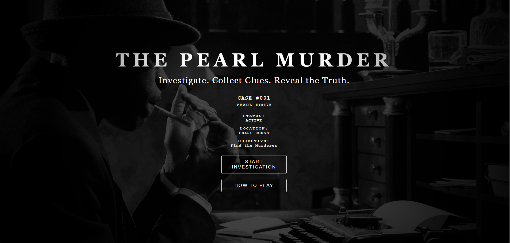
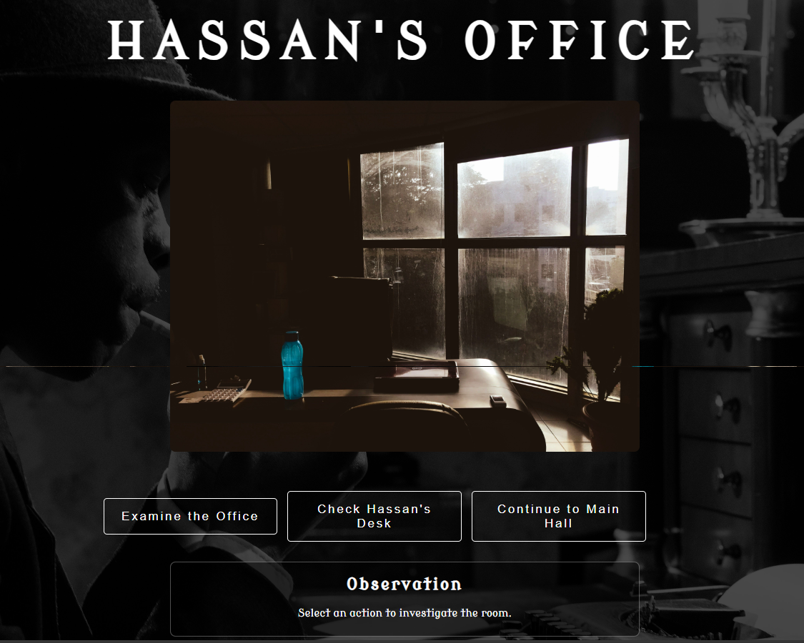
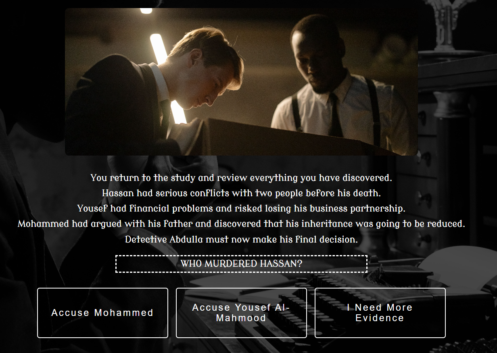

# The Pearl Murder

## Description
The Pearl Murder is a browser-based "Choose Your Own Adventure" detective game built with HTML, CSS, and JavaScript. Players investigate the murder of a wealthy pearl merchant by exploring different locations, questioning suspects, collecting clues, and making choices that lead to multiple possible endings.

## Functionality Used
1. HTML
2. CSS
3. JavaScript

## User Stories
1. As a player, I want to choose different actions so that I can shape the story and investigation.
2. As a player, I want to question suspects and search locations so that I can collect clues.
3. As a player, I want my choices to affect the outcome so that each playthrough can have a different ending.
4. As a player, I want to view the clues I have collected so that I can decide who the murderer is.
5. As a player, I want to restart the game after finishing so that I can explore different choices and endings.

## Screenshots

